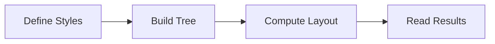

# 🍬 Taffy Layout Documentation

**High-performance, cross-platform UI layout engine.**

Taffy Layout is a high-performance layout engine written in Rust and compiled to WebAssembly for JS/TS. It implements browser-grade **Flexbox** and **Grid** algorithms without a DOM, making it ideal for terminal UIs, canvas renderers, game UI, and custom rendering engines.

## 🚀 What You Can Build

- 🖥️ **DOM-free Layouts**: CSS-style layouts for Canvas, WebGL, or Terminal apps.
- 🌳 **Massive Trees**: Handle large UI trees with fast, deterministic performance.
- 📏 **Custom Measurement**: Support for text, images, and dynamic content sizing.
- 🧩 **Reusable Patterns**: Layout patterns that map cleanly to UI components.

## 🗺️ Documentation Map

| Section                                                  | Description                                              |
| :------------------------------------------------------- | :------------------------------------------------------- |
| **[Getting Started](./getting-started/installation.md)** | Installation, initialization, and your first layout.     |
| **[Core Concepts](./core-concepts/overview.md)**         | The sizing model, available space, and measurement.      |
| **[Styling](./styling/index.md)**                        | Flexbox, Grid, Spacing, Sizing, and Positioning.         |
| **[Cookbook](./cookbook/index.md)**                      | Ready-to-copy layout patterns for common UIs.            |
| **[Advanced](./advanced/index.md)**                      | Debugging, performance optimization, and error handling. |
| **[API Reference](../api/index.md)**                     | Detailed API documentation (autogenerated).              |

## 🧠 Minimal Mental Model

Using Taffy involves three simple steps:

1.  **Construct**: Build a tree of nodes with styles.
2.  **Compute**: Calculate the layout based on available space.
3.  **Read**: Retrieve the computed `x`, `y`, `width`, and `height`.



```text
UI Tree Structure:
└── TaffyTree
    ├── Style (Input: Rules like Flex, Width, Padding)
    └── Layout (Output: Computed X, Y, Width, Height)
```

## ⏭️ Next Steps

- 👉 **[Quick Start](./getting-started/quick-start.md)** - Build your first layout in minutes.
- 📚 **[Styling Guide](./styling/index.md)** - Learn how to control layout.
- 🍱 **[Layout Cookbook](./cookbook/index.md)** - Copy-paste real-world examples.
